<!DOCTYPE html>
<html lang="br">
<head>
    <meta charset="UTF-8">
    <meta name="viewport" content="width=device-width, initial-scale=1.0">
    <title>POC 1 - Flexbox</title>
    <link rel="stylesheet" href="style.css">
</head>
<body>
    <!-- 1 ITEM -->
    <h1>display: flex</h1>
    <h2>display: flex</h2>
    <p>Display flex é a ferramenta principal do flexbox, pois o mesmo define um contêiner como um contêiner flexível e habilita as propriedades Flexbox nos seus filhos.</p> 
    <div class="cont1">
        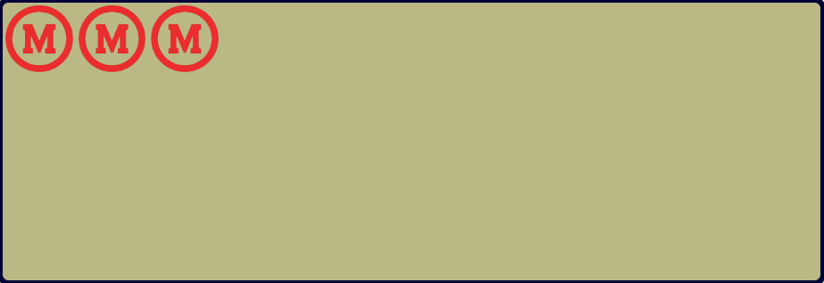
    </div>
    <!-- 2 ITEM -->
    <h1>flex-direction</h1>
    <p>flex-direction define a direção do eixo principal ao longo do qual os itens flexíveis são alinhados, sendo algumas dessas direções nomeadas como row, que alinha os itens da esquerda para a direita (padrão da programação), row reverse, funciona igual o row porém como o próprio nome diz, de trás pra frente, além deles temos também o column, que alinha os itens de cima para baixo e o seu oposto, o column-reverse, que alinha de baixo para cima</p> 
    <h2>column:</h2>
    <p>Alinha os itens de cima para baixo.</p> 
    <div class="cont1">
        <div class="column"> 
            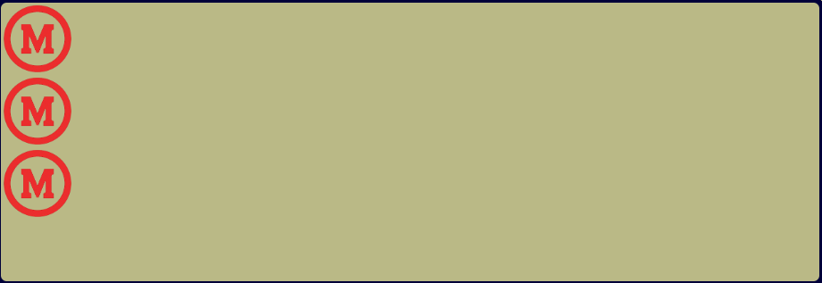
            ```css
            .column{
    display: flex;
    flex-direction:column;}
            ```css
            
        </div>
    </div>
    <h2>row-reverse:</h2>
    <p>Alinha os itens da direita para a esquerda.</p> 
    <div class="cont2">
        <div class="row-reverse">  
            
        </div>
    </div>
    <!-- 3 ITEM -->
    <h1>justify-content</h1>
    <p>Justify-content controla como os itens flexíveis são distribuídos ao longo do eixo principal, tendo algumas variantes principais, como flex-start, que alinha os itens ao início do contêiner, flex-end, que como oposto do anterior, alinha os itens ao final do contêiner, além deles temos o center que alinha os itens ao centro do contêiner e outros space-between, que distribui os itens com espaçamento igual entre eles e space-around, que distribui os itens com espaçamento igual ao redor de cada item.</p>
    <h2>center:</h2>
    <p> Alinha os itens ao centro do contêiner.</p> 
    <div class="cont30">
        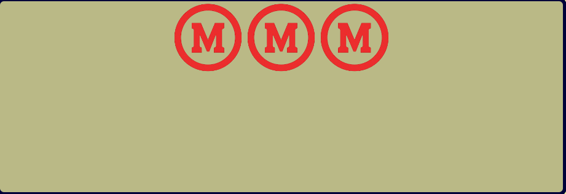
    </div>  
    <h2>flex-start:</h2>
    <p>Alinha os itens ao início do contêiner</p> 
    <div class="cont31">
        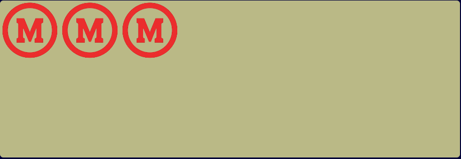
    </div>
    <h2>flex-end: </h2>
    <p>Alinha os itens ao final do contêiner.</p> 
    <div class="cont32">
        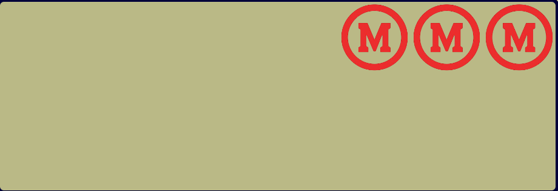
    </div>
    <h2>space-around:</h2>
    <p> Distribui os itens com espaçamento igual ao redor de cada item.</p> 
    <div class="cont33">
        
    </div>
    <h2>space-between: </h2>
    <p>Distribui os itens com espaçamento igual entre eles.</p> 
    <div class="cont34">
        
    </div>
    <!-- 4 ITEM-->
    <h1>Aling-Items</h1>
    <p>Align-items controla como os itens são alinhados ao longo do eixo transversal (perpendicular ao eixo principal), tendo como principais estilos de alinhamento, o flex-start, que alinha os itens ao início do contêiner, o seu oposto, flex-end, que alinha os itens ao final do contêiner, além deles também temos o center, que alinha os itens ao centro do contêiner tendo também o baseline, que alinha os itens ao longo da linha de base do contêiner e por fim o stretch, que estica os itens para preencher o contêiner (padrão).</p><br>
    <h2>flex-start:</h2>
    <p>Alinha os itens ao início do contêiner.</p> 
    <div class="cont40">
        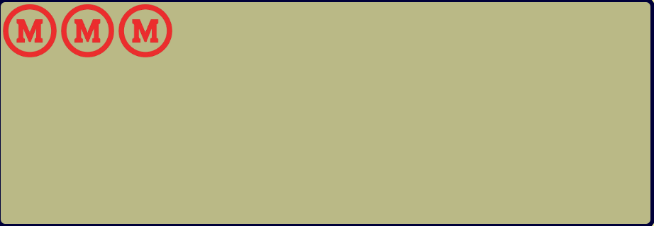
    </div>
    <h2>center:</h2>
    <p>O valor central alinha os itens flexíveis no meio do contêiner</p> 
    <div class="cont41">
        
    </div>
    <h2>flex-end:</h2>
    <p>Alinha os itens ao final do contêiner.</p>
    <div class="cont42">    
        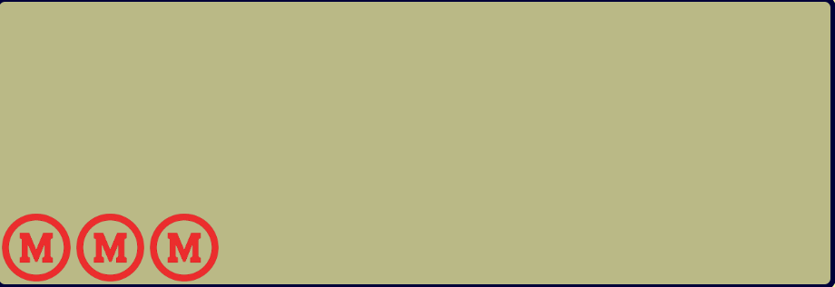
    </div>
    <h2>baseline:</h2>
    <p>Alinha os itens ao longo da linha de base do contêiner.</p>
    <div class="cont44">
        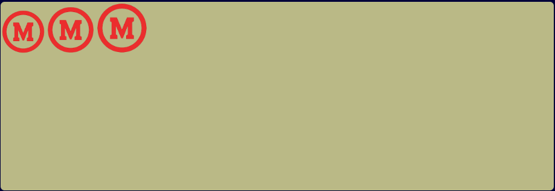
    </div><br>
    <h2>stretch:</h2>
    <p>Estatica os items para prencher o contêiner (padrão).</p>
    <div class="cont45">
        
    </div><br>
    <!-- 5 ITEM -->
    <h1>Aling-Content</h1>
    <p>Align-content controla a distribuição das linhas no contêiner quando há múltiplas linhas de itens (caso seja usado flex-wrap), tendo como suas variantes, o flex-start, que alinha as linhas ao início do contêiner, o seu oposto, flex-end, que alinha as linhas ao final do contêiner, além deles também temos o center, que alinha os itens ao centro do contêiner tendo também os opostos spacebetween, que distribui as linhas com espaçamento igual entre elas e o space-around, que distribui as linhas com espaçamento igual ao redor de cada linha e por fim o o stretch, que estica as linhas para preencher o contêiner (padrão).</p><br><br>
    <h2>space-between:</h2>
    <p>Distribui as linhas com espaçamento igual entre elas.</p>
    <div class="cont50">
        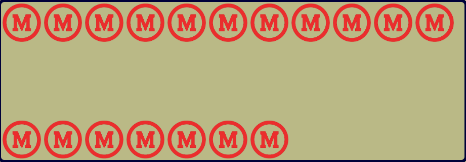
    </div><br>
    <h2>space-around:</h2>
    <p>Distribui as linhas com espaçamento igual ao redor de cada linha.</p>
    <div class="cont51">
        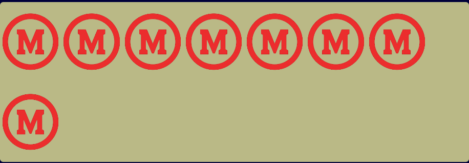
    </div><br>
    <h2>stretch:</h2>
    <p>Estatica as linhas para prencher o contêiner (padrão).</p>
    <div class="cont52">
        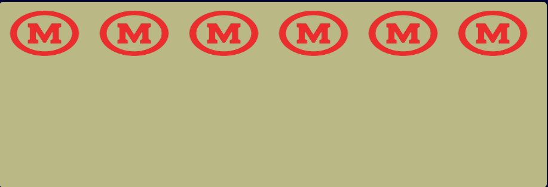
    </div><br>
    <h2>center:</h2>
    <p>Alinha os as linhas ao centro do contêiner.</p>
    <div class="cont53">
        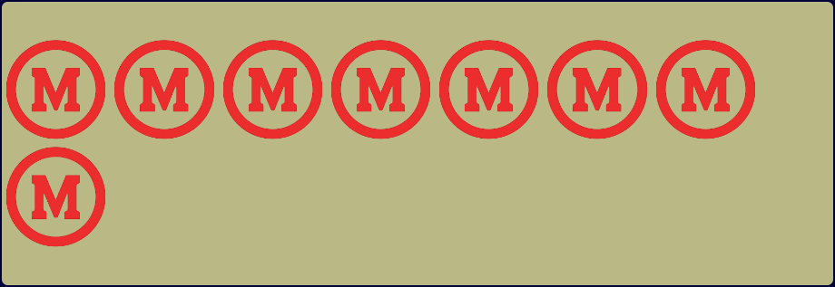
    </div><br>
    <h2>flex-start:</h2>
    <p>Alinha as linhas ao início do contêiner.</p>
    <div class="cont54">
        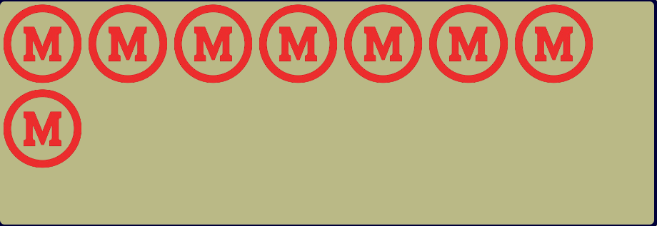
    </div><br>
    <h2>flex-end:</h2>
    <p>Alinha as linhas ao final do contêiner.</p>
    <div class="cont55">
        
    </div><br>
    <!-- 6 ITEM -->
    <h1>flex-wrap</h1>
    <p>Flex-wrap define se os itens devem ou não quebrar para uma nova linha, sendo suas variáveis, nowrap, que não permite a quebra de linha (padrão), wrap, que permite a quebra de linha e wrap-reverse, que permite a quebra de linha, mas a próxima linha é colocada acima da linha anterior.</p>
    <h2>wrap:</h2>
    <p>Permite a quebra de linha.</p>
    <div class="cont60">
        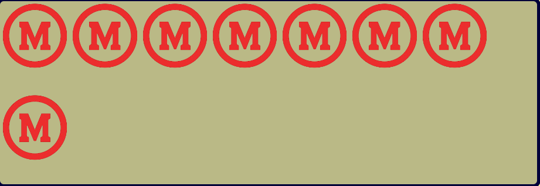
    </div><br>
    <h2>nowrap:</h2>
    <p>Não permite a quebra de linha (padrão).</p>
    <div class="cont61">
        
    </div><br>
    <h2>wrap-reverse:</h2>
    <p>O "flex-wrap: wrap-reverse;" especifica que os itens flexíveis serão agrupados se necessário, na ordem inversa</p>
    <div class="cont62">
        
    </div>
</body>
</html>


